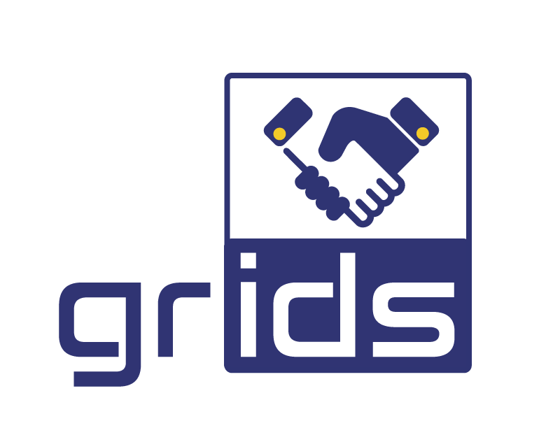

<!-- PROJECT LOGO -->
<br />
<div align="center">
  <a href="https://project-grids.eu">
    
  </a>

<h3 align="center">GRIDS Data Consumer Test Client</h3>

  <p align="center">
    increasinG tRust with eId for Developing buSiness
    <br />
    <a href="#usage"><strong>Explore the docs »</strong></a>
    <br />
    <br />
    <a href="#">View Demo</a>
    ·
    <a href="/../../issues">Report Bug</a>
    ·
    <a href="/../../issues">Request Feature</a>
  </p>
</div>


<!-- TABLE OF CONTENTS -->
<details>
  <summary>Table of Contents</summary>
  <ol>
    <li>
      <a href="#about-the-project">About The Project</a>
    </li>
    <li>
      <a href="#getting-started">Getting Started</a>
      <ul>
        <li><a href="#prerequisites">Prerequisites</a></li>
      </ul>
    </li>
    <li><a href="#usage">Usage</a></li>
  </ol>
</details>


<!-- ABOUT THE PROJECT -->
## About The Project

This is project's GRIDS Data Consumer test client using the [GRIDS SDK v1.0](https://github.com/ADACOM-SA/grids-sdk)

<p align="right">(<a href="#top">back to top</a>)</p>


<!-- GETTING STARTED -->
## Getting Started


### Prerequisites

* JDK 8+ 
* Nodejs
* Localtunnel (or alternatives like ngrok)


<!-- USAGE EXAMPLES -->
## Usage

1. Run localtunnel
```shell
lt --port 8080 -s <your_custom_domain> --print-requests

your url is: https://<your_custom_domain>.loca.lt
```

2. Setup enviroment variables
```
DCC_URI=http://vm.project-grids.eu:8082/auth/realms/grids/
DCC_MASTER_TOKEN=<eyJhbGciOiJIUzI...>
DC_URL=https://<your_custom_domain>.loca.lt/
DC_NAME=<name> test

DC_CLIENT_ID=<ad0a61f2...>
DC_CLIENT_SECRET=<94705f07...>

```
  Note1: You will have to request a DCC_MASTER_TOKEN from project's GRIDS staff

  Note2: To get ```DC_CLIENT_ID``` and ```DC_CLIENT_SECRET``` You will need to:
  * Setup first ```DCC_URI```, ```DCC_MASTER_TOKEN```, ```DC_URL``` and ```DC_NAME```
  * Run project and call https://<your_custom_domain>.loca.lt/client/register
  * Client id and secret will be printed.

3. Open https://<your_custom_domain>.loca.lt to your browser. You should should a Click here to login.
4. Login with eiDAS
5. After successful login you will see IdToken, AccessToken and Data providers 1 and 2 responses

Note: For Data Provider One  you can call https://<your_custom_domain>.loca.lt/2
and for Data Provider One you can call https://<your_custom_domain>.loca.lt/3

<p align="right">(<a href="#top">back to top</a>)</p>